# Study_Simulated_Annealing  


焼きなまし法の検討。  


数式を定義すべきだが面倒なので Rhino で NxN の形の PointArray を用意し、この PointArray から Polygon を作成し計算に用いる（実際には、Polygon として作成し計算にかけるのは近傍のみとする）。  

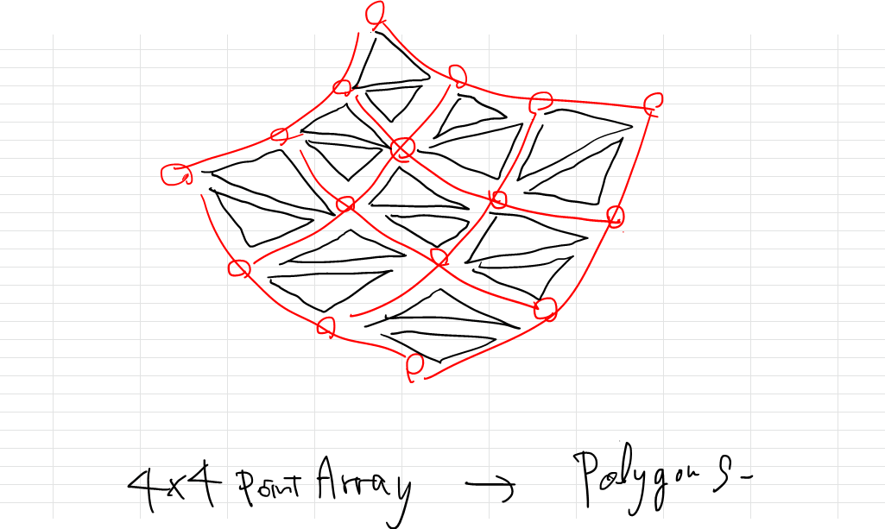  

計算する近傍のポリゴンを絞るために、先に計算領域を産出し今計算する点がどの領域であるか判別し、その領域の Polygon を計算する。  

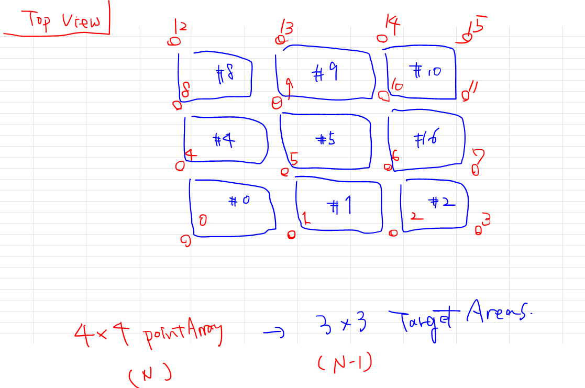  

XY 座標を変数に取り、Polygon へ Ray を飛ばし Interset の座標を求めその Z 座標を返り値をする。  

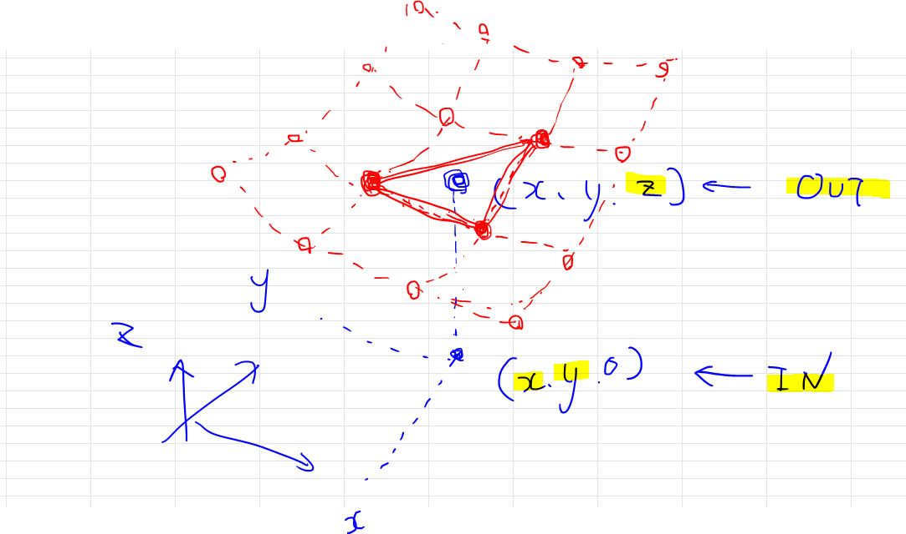  

返り値を評価し、小さいほうへ探索していく。  


### Case Study  

2変数の時の最小値（設計値）  
これをポリゴンに置き換えていいるので実際の値は少し異なる  

```
X : 13.519914  
Y : 13.317021
Z : 0.0
```


##### Case_0  

```
X : 13.99814906092195
Y : 12.998413191448998
Z : 0.013334665526461913
```

Src  
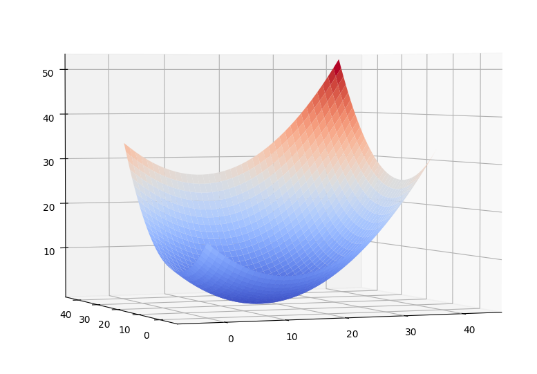  

Log_0  
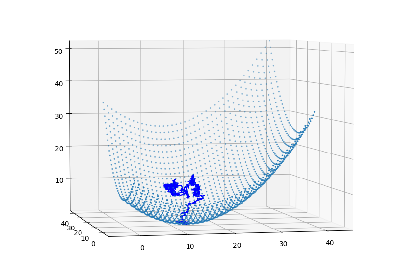  

Log_1  
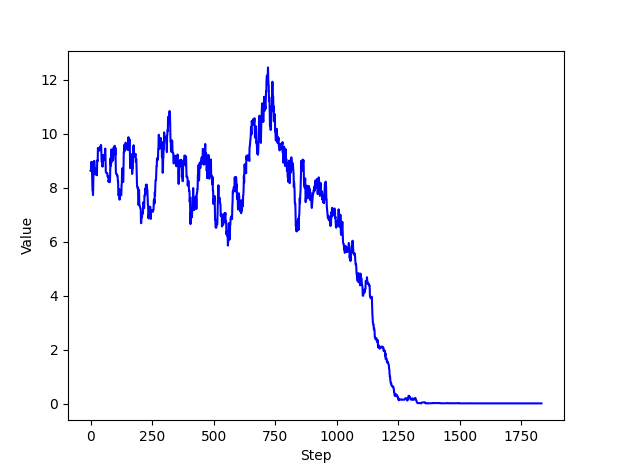  


##### Case_1  

```
X : 13.954662779815724
Y : 12.996927261965402
Z : 0.06923775727083913
```

Src  
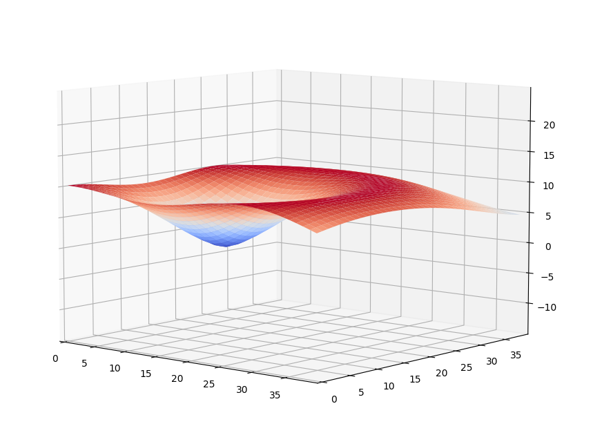  


Log_0  
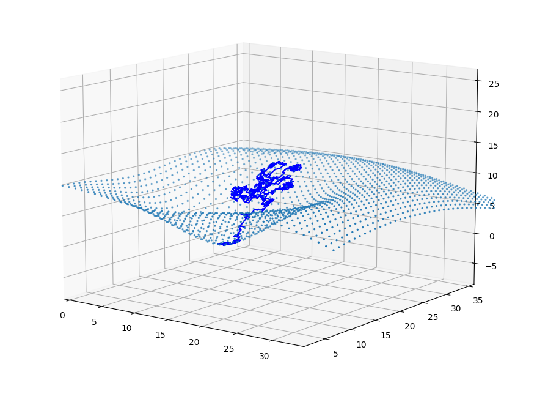  

Log_1  
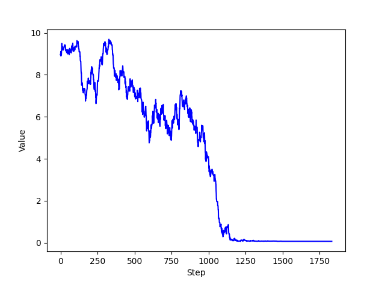  


##### Case_2  

```
X : 13.999644469073209
Y : 13.992712797153942
Z : 0.002987433388815319
```

Src  
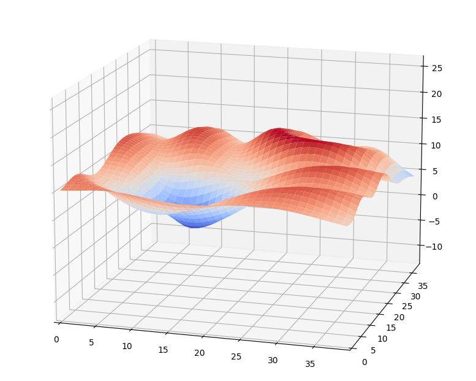  

Log_0  
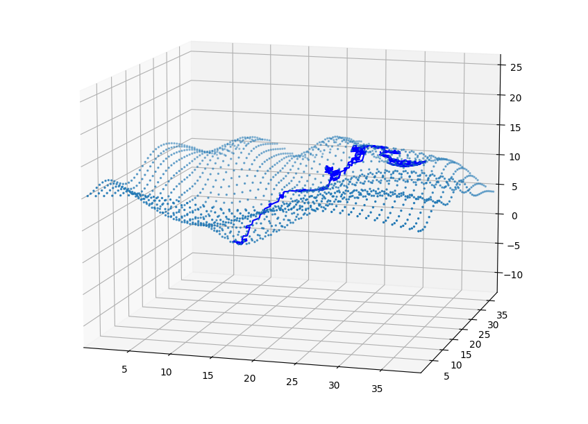  

Log_1  
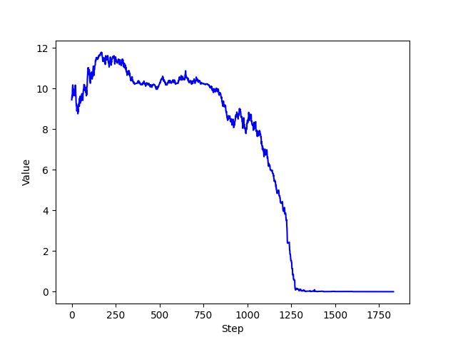  


Log_0_A  
局所解に落ちている  
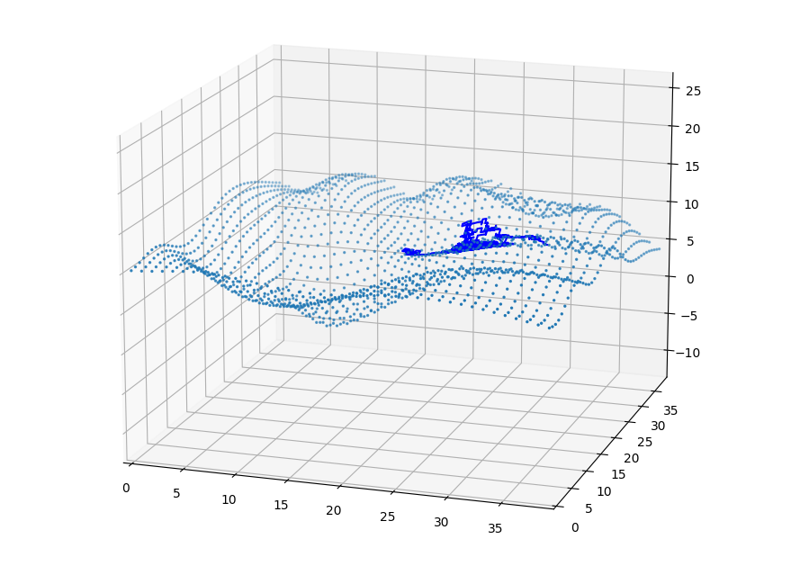  

Log_1_A  
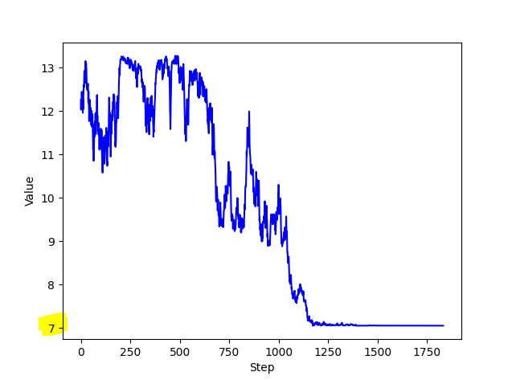  


### Ref  


最適化アルゴリズム (sonoshouのまじめなブログ)  
  [https://sonoshou.hatenablog.jp/entry/20120927/1348757450](https://sonoshou.hatenablog.jp/entry/20120927/1348757450)  


レイと三角形の交差判定（Pheemaの学習帳）  
  [https://pheema.hatenablog.jp/entry/ray-triangle-intersection](https://pheema.hatenablog.jp/entry/ray-triangle-intersection)  


RayTriangleIntersection (以前実装したものを利用)  
  [https://github.com/naysok/Mesh_Vertex_Color/blob/c6fafe480957305176ac1adc14c093d9278baa94/mesh_vertex_color/np_ray_triangle_intersection.py](https://github.com/naysok/Mesh_Vertex_Color/blob/c6fafe480957305176ac1adc14c093d9278baa94/mesh_vertex_color/np_ray_triangle_intersection.py)  